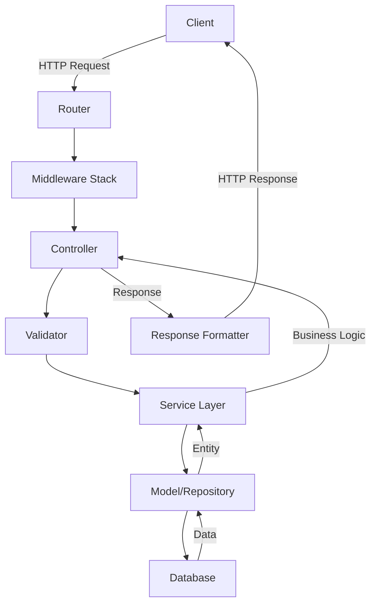

# Architecture Documentation

## 🏗️ Architecture Overview

Local Spots is built on **AdonisJS 6**, a Node.js TypeScript-first framework that follows the MVC (Model-View-Controller) pattern with a modular and extensible architecture.

## 📁 Project Structure

```
local-spots/
├── app/                    # Main source code
│   ├── controllers/        # HTTP controllers
│   ├── exceptions/         # Custom exception handlers
│   ├── middleware/         # HTTP middleware
│   ├── models/            # Lucid ORM models
│   ├── services/          # Business services
│   └── validators/        # VineJS validation schemas
├── config/                # Application configuration
│   ├── app.ts            # General configuration
│   ├── auth.ts           # Authentication configuration
│   ├── cors.ts           # CORS configuration
│   ├── database.ts       # Database configuration
│   └── hash.ts           # Hashing configuration
├── database/              # Database
│   ├── migrations/        # Schema migrations
│   └── seeders/          # Data seeders
├── start/                 # Startup files
│   ├── routes.ts         # Route definitions
│   ├── kernel.ts         # HTTP kernel configuration
│   └── events.ts         # Event listeners
├── tests/                 # Tests
│   ├── functional/       # Functional tests
│   └── unit/            # Unit tests
├── providers/            # Custom service providers
└── bin/                  # Executable scripts
```

## 🔄 Data Flow



## 🏛️ Architectural Layers

### 1. Presentation Layer (Controllers)

Controllers handle HTTP requests and orchestrate business logic.

```typescript
// app/controllers/spots_controller.ts
export default class SpotsController {
  async index({ request, response }: HttpContext) {
    const page = request.input('page', 1)
    const limit = request.input('limit', 10)
    
    const spots = await SpotService.paginate(page, limit)
    
    return response.ok(spots)
  }

  async store({ request, response, auth }: HttpContext) {
    const payload = await request.validateUsing(createSpotValidator)
    const spot = await SpotService.create(auth.user!, payload)
    
    return response.created(spot)
  }
}
```

### 2. Validation Layer

Using VineJS for incoming data validation.

```typescript
// app/validators/spot_validator.ts
import vine from '@vinejs/vine'

export const createSpotValidator = vine.compile(
  vine.object({
    name: vine.string().minLength(3).maxLength(255),
    description: vine.string().optional(),
    latitude: vine.number().min(-90).max(90),
    longitude: vine.number().min(-180).max(180),
    category: vine.enum(['restaurant', 'cafe', 'bar', 'park'])
  })
)
```

### 3. Service Layer

Business logic is encapsulated in reusable services.

```typescript
// app/services/spot_service.ts
export default class SpotService {
  static async create(user: User, data: CreateSpotDTO): Promise<Spot> {
    // Business logic
    const spot = await Spot.create({
      ...data,
      userId: user.id
    })

    // Trigger events
    await Event.emit('spot:created', spot)

    return spot
  }

  static async findNearby(lat: number, lng: number, radius: number) {
    return await Spot.query()
      .whereRaw(
        `ST_DWithin(location, ST_MakePoint(?, ?)::geography, ?)`,
        [lng, lat, radius * 1000]
      )
  }
}
```

### 4. Model Layer (Models)

Lucid ORM models represent database entities.

```typescript
// app/models/spot.ts
import { BaseModel, column, belongsTo } from '@adonisjs/lucid/orm'
import User from './user.js'

export default class Spot extends BaseModel {
  @column({ isPrimary: true })
  declare id: number

  @column()
  declare name: string

  @column()
  declare latitude: number

  @column()
  declare longitude: number

  @belongsTo(() => User)
  declare user: BelongsTo<typeof User>

  @column.dateTime({ autoCreate: true })
  declare createdAt: DateTime

  @column.dateTime({ autoCreate: true, autoUpdate: true })
  declare updatedAt: DateTime
}
```

### 5. Middleware Layer

Middleware intercepts and processes requests.

```typescript
// app/middleware/auth_middleware.ts
export default class AuthMiddleware {
  async handle(
    { auth }: HttpContext,
    next: NextFn
  ) {
    await auth.check()
    return next()
  }
}
```

## 🔐 Authentication & Authorization

### Authentication

Using the `@adonisjs/auth` package with JWT strategy:

```typescript
// config/auth.ts
export default authConfig({
  default: 'api',
  guards: {
    api: sessionGuard({
      useRememberMeTokens: false,
      provider: sessionUserProvider({
        model: () => import('#models/user'),
      }),
    }),
  },
})
```

### Authorization

Policy system for managing permissions:

```typescript
// app/policies/spot_policy.ts
export default class SpotPolicy {
  async update(user: User, spot: Spot) {
    return user.id === spot.userId
  }

  async delete(user: User, spot: Spot) {
    return user.id === spot.userId || user.isAdmin
  }
}
```

## 🗄️ Database Strategy

### ORM: Lucid

- **Query Builder**: Type-safe SQL query construction
- **Migrations**: Database schema versioning
- **Models**: Object-relational mapping
- **Hooks**: Model lifecycle hooks

### Optimizations

1. **Eager Loading** to avoid N+1 problem
```typescript
const spots = await Spot.query()
  .preload('user')
  .preload('reviews')
```

2. **Strategic Indexing**
```typescript
// migration
table.index(['latitude', 'longitude'], 'location_index')
table.index('category', 'category_index')
```

3. **Automatic Pagination**
```typescript
const spots = await Spot.query().paginate(page, limit)
```

## 🔄 Design Patterns

### 1. Repository Pattern (optional)

```typescript
// app/repositories/spot_repository.ts
export default class SpotRepository {
  async findById(id: number): Promise<Spot | null> {
    return await Spot.find(id)
  }

  async findByCategory(category: string): Promise<Spot[]> {
    return await Spot.query().where('category', category)
  }
}
```

### 2. Service Pattern

Separation of business logic from controllers.

### 3. DTO Pattern

```typescript
// app/dto/create_spot_dto.ts
export interface CreateSpotDTO {
  name: string
  description?: string
  latitude: number
  longitude: number
  category: string
}
```

### 4. Event-Driven Architecture

```typescript
// start/events.ts
import Event from '@adonisjs/core/services/event'

Event.on('spot:created', 'SpotListener.onCreated')
Event.on('user:registered', 'UserListener.sendWelcomeEmail')
```

## 🚀 Performance

### Caching Strategy

```typescript
// app/services/cache_service.ts
export default class CacheService {
  static async remember<T>(
    key: string,
    ttl: number,
    callback: () => Promise<T>
  ): Promise<T> {
    const cached = await Redis.get(key)
    
    if (cached) {
      return JSON.parse(cached)
    }

    const fresh = await callback()
    await Redis.setex(key, ttl, JSON.stringify(fresh))
    
    return fresh
  }
}
```

### Queue System

For asynchronous tasks:

```typescript
// app/jobs/send_notification_job.ts
export default class SendNotificationJob {
  static get key() {
    return 'SendNotificationJob'
  }

  async handle(data: any) {
    // Notification sending logic
  }
}
```

## 🔒 Security

### Built-in Protections

1. **CSRF Protection**: CSRF token for forms
2. **SQL Injection**: Protection via Lucid ORM
3. **XSS Protection**: Automatic escaping
4. **Rate Limiting**: Request limiting

```typescript
// start/kernel.ts
router.use([
  () => import('@adonisjs/core/bodyparser_middleware'),
  () => import('@adonisjs/shield/shield_middleware'),
  () => import('@adonisjs/auth/auth_middleware'),
])
```

### Security Headers

```typescript
// config/shield.ts
export default shieldConfig({
  csp: {
    enabled: true,
    directives: {
      defaultSrc: ["'self'"],
      scriptSrc: ["'self'", "'unsafe-inline'"],
    },
  },
  xFrame: {
    enabled: true,
    action: 'DENY',
  },
})
```

## 🧪 Testing Strategy

### Test Structure

```
tests/
├── functional/     # Integration/API tests
│   ├── auth/      # Authentication tests
│   └── spots/     # Spots endpoints tests
├── unit/          # Unit tests
│   ├── models/    # Model tests
│   └── services/  # Service tests
└── fixtures/      # Test data
```

### Test Types

1. **Unit tests**: Services, helpers, utilities
2. **Functional tests**: API endpoints
3. **Integration tests**: Complete workflows

## 📈 Monitoring & Logging

### Logging with Pino

```typescript
import logger from '@adonisjs/core/services/logger'

logger.info('Spot created', { spotId: spot.id })
logger.error('Failed to create spot', error)
```

### Health Checks

```typescript
// start/routes.ts
Route.get('/health', async ({ response }) => {
  const dbHealthy = await Database.healthCheck()
  
  return response.json({
    status: dbHealthy ? 'healthy' : 'unhealthy',
    timestamp: DateTime.now().toISO(),
  })
})
```

## 🔄 CI/CD Pipeline

```yaml
# .github/workflows/ci.yml
name: CI

on: [push, pull_request]

jobs:
  test:
    runs-on: ubuntu-latest
    steps:
      - uses: actions/checkout@v2
      - name: Setup Node
        uses: actions/setup-node@v2
      - run: npm ci
      - run: npm run lint
      - run: npm run typecheck
      - run: npm test
```

## 📦 Main Dependencies

| Package | Role |
|---------|------|
| @adonisjs/core | Main framework |
| @adonisjs/lucid | ORM and Query Builder |
| @adonisjs/auth | Authentication |
| @vinejs/vine | Validation |
| pg | PostgreSQL driver |

## 🎯 Architectural Principles

1. **Separation of Concerns**: Each layer has a single responsibility
2. **DRY (Don't Repeat Yourself)**: Reuse via services and helpers
3. **SOLID Principles**: Maintainable and extensible code
4. **Type Safety**: TypeScript for type security
5. **Testability**: Architecture facilitating testing

## 🔮 Future Evolutions

- [ ] GraphQL implementation
- [ ] Microservices architecture
- [ ] Event sourcing
- [ ] CQRS pattern
- [ ] WebSocket support
- [ ] Distributed cache with Redis
